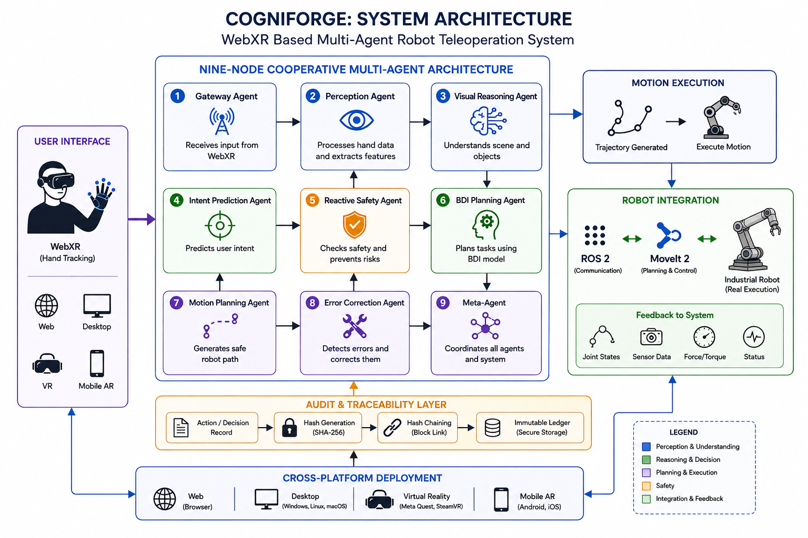

````markdown
# BE Capstone Project

## Project Title

**COGNIFORGE: A Verified Multi-Agent Architecture for Contingency-Aware, Audit-Traceable Robot Teleoperation in WebXR**

---

## Team Details

| Sr. No. | Name of Student | Roll No. | Branch | Email ID |
|---|---|---|---|---|
| 1 | ANAMIKA AHUJA | 01 | AURO | 2023.anamika.ahuja@ves.ac.in |
| 2 | ADITYA SHARMA | 27 | AURO | d2024.aditya.sharma@ves.ac.in |
| 3 | SHRADDHA VAYACHAL | 30 | AURO | d2024.shraddha.vayachal@ves.ac.in |
| 4 | SANA SHAIKH | 62 | AURO | d2024.sana.shaikh@ves.ac.in |

---

## Guide Details

**Project Guide: Mrs. Ramya T**  
**Department:** Automation and Robotics  
**Institute:** VESIT, Mumbai  

---

## Problem Statement

The aim of this project is to develop a browser-based WebXR robot teleoperation platform using a verified nine-node cooperative multi-agent architecture to enable intuitive robot programming by demonstration. The proposed system integrates perception, reasoning, contingency-aware motion planning, Damped Least Squares inverse kinematics, and a hash-chained audit framework to ensure safe, transparent, and audit-traceable robot operation across Web, Desktop, Virtual Reality (VR), and Mobile Augmented Reality (AR) platforms.
---

## Abstract
# Abstract

Industrial robot programming traditionally relies on vendor-specific programming languages, teach pendants, and manual configuration, making it complex, time-consuming, and inaccessible to non-expert users. Furthermore, existing approaches provide limited transparency into robot decision-making, making verification and auditing difficult. This project, **COGNIFORGE: A Verified Multi-Agent Architecture for Contingency-Aware, Audit-Traceable Robot Teleoperation in WebXR**, addresses these challenges by developing a browser-based robot teleoperation platform that enables intuitive robot programming through natural hand demonstrations in an immersive WebXR environment.
The proposed system employs a verified **nine-node cooperative multi-agent architecture** integrating perception, visual reasoning, intent prediction, reactive safety, Belief–Desire–Intention (BDI) planning, contingency-aware motion planning, Damped Least Squares inverse kinematics, error correction, and a hash-chained audit ledger to ensure safe, transparent, and verifiable robot operation. The platform is designed for deployment across Web, Desktop, Virtual Reality (VR), and Mobile Augmented Reality (AR) environments, providing a flexible and cross-platform solution for robot teleoperation.
Although physical robot integration is planned for future work using ROS2 and MoveIt2, the current implementation has been validated through comprehensive software verification and cross-platform testing. The expected outcome is a secure, intelligent, and audit-traceable robot teleoperation framework that simplifies robot programming while enhancing safety, reliability, and transparency. The proposed system has applications in industrial automation, smart manufacturing, collaborative robotics, research laboratories, training and education, and remote robot operation.


---

## Objectives

1. To study the limitations of existing industrial robot programming methods and analyze current WebXR and robot teleoperation technologies.
2. To design a browser-based WebXR robot teleoperation system using a verified nine-node cooperative multi-agent architecture.
3. To implement intelligent perception, planning, inverse kinematics, contingency-aware motion planning, and audit-traceable decision logging for safe robot programming.
4. To integrate and validate the proposed framework with a physical robotic manipulator using ROS2 and MoveIt2, enabling real-world robot teleoperation.
5. To verify and evaluate the system through software testing, cross-platform deployment, performance analysis, and comprehensive documentation, with the objective of publishing the research findings.
6. To document the system architecture, implementation, verification, and experimental results, and prepare the work for research publication,
---

## Scope of the Project

Design and development of a browser-based WebXR robot teleoperation platform.
Implementation of a verified nine-node cooperative multi-agent architecture for perception, planning, safety, and robot control.
Development of cross-platform applications for Web, Desktop, Virtual Reality (VR), and Mobile Augmented Reality (AR).
Integration of Programming by Demonstration (PbD), Damped Least Squares inverse kinematics, contingency-aware motion planning, collision checking, and audit-traceable logging.
Software verification, cross-platform testing, performance evaluation, and system validation.
Integration and testing with a physical industrial robot using ROS2 and MoveIt2 for real-world deployment.

---

## Existing System

Existing industrial robot programming primarily relies on vendor-specific programming languages, teach pendants, and kinesthetic teaching methods. Robot teleoperation systems also use conventional interfaces such as joysticks, graphical user interfaces, or standalone VR applications. While these approaches enable robot control, they often require specialized training and provide limited flexibility for intuitive human–robot interaction.

Limitations of Existing Systems
Requires specialized programming expertise and vendor-specific knowledge.
Time-consuming and manual robot programming process using teach pendants or coding.
Limited accessibility for non-expert users due to complex interfaces.
Lack of transparency and auditability, making robot decisions difficult to verify.
Limited adaptability to dynamic environments and changing task conditions.
Limited cross-platform support, with many solutions restricted to specific hardware or software ecosystems.
Insufficient integration of intelligent decision-making, safety verification, and contingency-aware planning.
---

## Proposed System

Main Idea

Develop a browser-based WebXR robot teleoperation platform that enables intuitive robot programming through natural hand demonstrations using a verified nine-node cooperative multi-agent architecture.

How It Works
Captures the operator's hand movements using WebXR.
Processes user inputs through intelligent agents for perception, reasoning, planning, and safety.
Generates safe robot trajectories using contingency-aware motion planning and Damped Least Squares inverse kinematics.
Records every decision in a hash-chained audit ledger to ensure transparent and verifiable robot operation.
Supports future execution on a physical robot through ROS2 and MoveIt2 integration.

Major Components
WebXR-based User Interface
Nine-Node Cooperative Multi-Agent Architecture
Perception and Visual Reasoning Modules
BDI Planning and Motion Planning
Inverse Kinematics and Collision Checking
Hash-Chained Audit Logging
Cross-Platform Deployment (Web, Desktop, VR, Mobile AR)
ROS2 & MoveIt2 Integration (Future Scope)

Expected Benefits
Simplifies industrial robot programming through natural interaction.
Improves safety using intelligent planning and collision avoidance.
Provides transparent and audit-traceable robot decision-making.
Enables cross-platform accessibility across Web, Desktop, VR, and AR.
Establishes a scalable framework for future deployment on physical industrial robots.
---

## System Architecture




The proposed system follows a **browser-based WebXR architecture** built around a **verified nine-node cooperative multi-agent framework**. The operator interacts with the system through a WebXR interface, where natural hand movements are captured and interpreted as robot commands. These inputs are processed sequentially by the **Gateway Agent**, **Perception Agent**, **Visual Reasoning Agent**, and **Intent Prediction Agent** to understand the user's actions. The **Reactive Safety Agent** continuously checks for unsafe conditions, while the **Belief–Desire–Intention (BDI) Planning Agent** and **Motion Planning Agent** generate safe and efficient robot trajectories. The **Error Correction Agent** resolves execution issues, and the **Meta-Agent** monitors the overall system to coordinate communication between agents. All decisions and actions are securely recorded in a **hash-chained audit ledger**, ensuring transparency and traceability. The generated motion commands are validated using **Damped Least Squares inverse kinematics** and are designed for future execution on a physical robot through **ROS2 and MoveIt2**. The architecture supports deployment across **Web, Desktop, Virtual Reality (VR), and Mobile Augmented Reality (AR)** platforms, providing a scalable and cross-platform robot teleoperation solution. 

---

## Hardware Requirements

| Sr. No. | Component | Specification | Quantity | Purpose |
| ------- | --------- | ------------- | -------- | ------- |
| 1       |           |               |          |         |
| 2       |           |               |          |         |
| 3       |           |               |          |         |
| 4       |           |               |          |         |

---

## Software Requirements

| Sr. No. | Software / Tool | Version | Purpose |
| ------- | --------------- | ------- | ------- |
| 1       |                 |         |         |
| 2       |                 |         |         |
| 3       |                 |         |         |

---

## Technologies Used

Mention technologies used in the project.

Example:

* Embedded C / Python / JavaScript
* Arduino / STM32 / ESP32 / Raspberry Pi
* ROS / MATLAB / Simulink
* Machine Learning / Computer Vision
* IoT / Cloud / Mobile App
* PCB Design / CAD Design

---

## Methodology

Explain the step-by-step approach.

1. Literature survey
2. Problem identification
3. Requirement analysis
4. System design
5. Hardware/software development
6. Integration
7. Testing and validation
8. Documentation and publication

---

## Project Timeline

| Week / Month | Task Planned          | Status                            |
| ------------ | --------------------- | --------------------------------- |
| Week 1       | Problem finalization  | Pending / In Progress / Completed |
| Week 2       | Literature survey     |                                   |
| Week 3       | Requirement analysis  |                                   |
| Week 4       | System design         |                                   |
| Week 5       | Prototype development |                                   |
| Week 6       | Testing               |                                   |
| Week 7       | Documentation         |                                   |
| Week 8       | Paper writing         |                                   |

---

## Weekly Progress Updates

Students must update this section every week.

| Week   | Date | Work Completed | Work Planned for Next Week | Issues / Challenges | GitHub Commit Link |
| ------ | ---- | -------------- | -------------------------- | ------------------- | ------------------ |
| Week 1 |      |                |                            |                     |                    |
| Week 2 |      |                |                            |                     |                    |
| Week 3 |      |                |                            |                     |                    |
| Week 4 |      |                |                            |                     |                    |
| Week 5 |      |                |                            |                     |                    |
| Week 6 |      |                |                            |                     |                    |
| Week 7 |      |                |                            |                     |                    |
| Week 8 |      |                |                            |                     |                    |

---

## Design Files

Upload and link all design files here.

| File Type       | File Name / Link | Description |
| --------------- | ---------------- | ----------- |
| CAD Model       |                  |             |
| Circuit Diagram |                  |             |
| PCB Design      |                  |             |
| Flowchart       |                  |             |
| Simulation File |                  |             |

---

## Circuit Diagram

Add circuit diagram image here.

```markdown

```

---

## Flowchart / Algorithm

Add flowchart image here.

```markdown

```

### Algorithm

1. Start
2. Initialize the system
3. Read input from sensors/user
4. Process the data
5. Generate output/control action
6. Display/store/transmit result
7. Stop

---

## Implementation Details

Explain the actual implementation of the project.

### Hardware Implementation

Write details about connections, components, power supply, sensors, actuators, PCB, enclosure, etc.

### Software Implementation

Write details about code structure, libraries used, algorithms, communication protocols, database, app, cloud, etc.

---

## Code Structure

```text
BE-Capstone-Project/
│
├── README.md
├── docs/
│   ├── literature_survey.md
│   ├── project_report.pdf
│   └── presentation.pptx
│
├── hardware/
│   ├── circuit_diagram.png
│   ├── pcb_design/
│   └── cad_model/
│
├── software/
│   ├── src/
│   ├── include/
│   └── tests/
│
├── images/
│   ├── system_architecture.png
│   ├── prototype_photo.jpg
│   └── results.png
│
└── references/
    └── papers/
```

---

## How to Run the Project

### Step 1: Clone the Repository

```bash
git clone https://github.com/username/project-name.git
```

### Step 2: Install Dependencies

```bash
pip install -r requirements.txt
```

or mention specific software/library installation steps.

### Step 3: Upload / Run the Code

```bash
python main.py
```

or

```bash
arduino-cli upload -p COMx --fqbn board_name
```

### Step 4: Observe the Output

Mention the expected output of the project.

---

## Testing and Results

| Test No. | Test Description | Expected Result | Actual Result | Status      |
| -------- | ---------------- | --------------- | ------------- | ----------- |
| 1        |                  |                 |               | Pass / Fail |
| 2        |                  |                 |               | Pass / Fail |
| 3        |                  |                 |               | Pass / Fail |

---

## Result Images / Videos

Add images or videos of the working prototype.

```markdown

```

Video Link:

```markdown
[Project Demo Video](https://drive.google.com/your-video-link)
```

---

## Applications

Mention real-world applications of the project.

1.
2.
3.
4.

---

## Advantages

1.
2.
3.
4.

---

## Limitations

1.
2.
3.
4.

---

## Future Scope

Mention possible improvements.

1.
2.
3.
4.

---

## Research Paper / Publication

| Item                      | Details                                                   |
| ------------------------- | --------------------------------------------------------- |
| Paper Title               |                                                           |
| Conference / Journal Name |                                                           |
| Paper Status              | Not Started / Drafting / Submitted / Accepted / Published |
| Submission Date           |                                                           |
| Paper Link                |                                                           |

---

## References

Add references in IEEE format.

Example:

```text
[1] A. Author, B. Author, "Title of the Paper," Journal/Conference Name, vol. X, no. Y, pp. xx-yy, Year.
[2] Datasheet / Website / Book reference.
```

---

## Repository Update Guidelines

Each student team must update the GitHub repository regularly.

Minimum expected updates:

* Update README every week.
* Push code changes regularly.
* Upload circuit diagrams, CAD files, PCB files, reports and presentations.
* Add weekly progress in the progress table.
* Maintain proper folder structure.
* Do not upload unnecessary temporary files.
* Each major update should have a meaningful commit message.

Example commit messages:

```text
Added problem statement and objectives
Updated system architecture diagram
Added sensor interfacing code
Updated weekly progress for Week 3
Added testing results and prototype images
```

---

## Declaration

We declare that this project work is carried out by our team as part of the BE Capstone Project. The work will be regularly updated on GitHub and all references used will be properly cited.

---

## License

This project is for academic use only.

Optional:

```text
MIT License / Creative Commons / Institute Use Only
```

```
```
